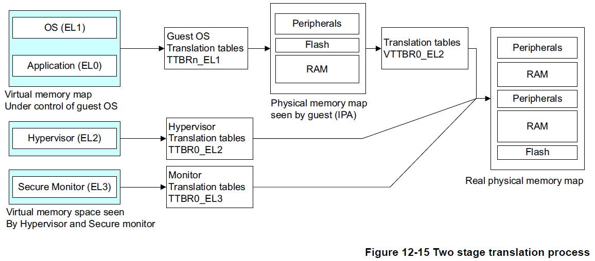
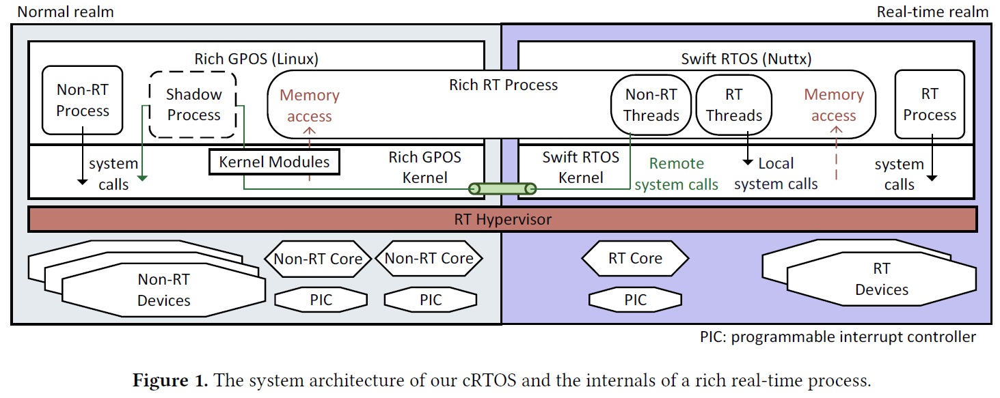

# Hypervisor 技术资料调研

## ARM64架构的Hypervisor实现

**ARM Hypervisor**介绍 
https://github.com/arceos-hypervisor/2023-virtualization-campus/blob/master/hypervisor/aarch64/README.md

其中较关键的虚拟化内存地址空间翻译架构

ARM64架构基于ArceOS的hypervisor-TSM 
https://github.com/arceos-hypervisor/arceos/tree/hypervisor-aarch64-dev

架构图 

**北航**老师的Rust-Shyper Monitor VM设计 
在rk3588板子上实现了GICv3中断处理 
https://gitee.com/openeuler/rust_shyper.git

Rust-Shyper：基于 Rust 语言的高可靠、开源嵌入式 Hypervisor 
https://mp.weixin.qq.com/s/geek_RSO8UseiGbUmrtWDw

莫策-ARMv8体系结构与硬件虚拟化 
https://github.com/arceos-hypervisor/2023-virtualization-campus/blob/master/PPT/%E8%8E%AB%E7%AD%96-ARMv8%E4%BD%93%E7%B3%BB%E7%BB%93%E6%9E%84%E4%B8%8E%E7%A1%AC%E4%BB%B6%E8%99%9A%E6%8B%9F%E5%8C%96.pdf

**基于C语言的轻量级静态分区hypervisor-Bao** 
https://github.com/bao-project/bao-hypervisor.git

基于ArceOS的vmm-HKY 
https://github.com/hky1999/arceos/tree/vmm

## x86_64架构的Hypervisor实现
### ArceOS Hypervisor x86_64
基于**x86_64架构** ArceOS的Hypervisor - TSM 
https://github.com/915604903T/arceos/tree/hypervisor-x86

### Type-1.5 hypervisor
基于jailhouse的**x86_64架构**的用Rust写-JYK 
https://github.com/equation314/RVM-Tutorial/wiki

### cRTOS
通过分区hypervisor在cRTOS复合实时操作系统中获得硬实时性能和丰富的Linux功能
论文链接
https://dl.acm.org/doi/10.1145/3381052.3381323

代码基于**x86_64架构**仓库 
https://github.com/fixstars/cRTOS

cRTOS 系统架构

## Hypervisor虚拟化课程-HW

Hypervisor虚拟化课程仓库：
https://github.com/arceos-hypervisor/2023-virtualization-campus.git

基于**RISCV架构**的ArceOS编写的 VMM 库
QCX-hypercraft 设计理念与架构
https://github.com/arceos-hypervisor/hypercraft

课件PPT：
https://github.com/arceos-hypervisor/2023-virtualization-campus/tree/master/PPT

虚拟化书籍推荐：
[《系统虚拟化：原理与实现》](books/系统虚拟化原理与实现.pdf)